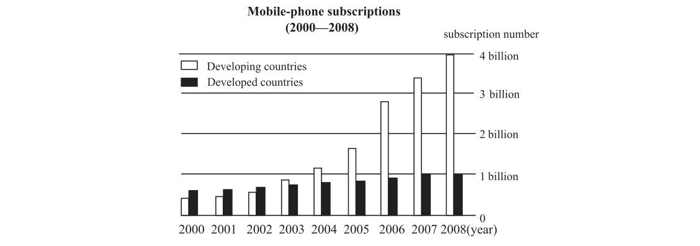

# 2010 写作 · 大作文（图表作文）

> 英语（二）Section Ⅳ Part B · 15 分 · 至少 150 词

In this section, you are asked to write an essay based on the following chart. In your writing, you should 1) interpret the chart and 2) give your comments. You should write at least 150 words.

